<div align="center">


</div>

<div align="center">

<a href="https://readme-typing-svg.demolab.com">
  
</a>

<br/>

[](https://www.linkedin.com/in/nandan-p-aghera/)
[](https://x.com/agheranandan2)
[](mailto:nandanaghera@gmail.com)
[](https://github.com/nandan29300)
[](#)

<br/>


</div>

---


## 🧠 About Me

```yaml
apiVersion: v1
kind: Developer
metadata:
  name: Nandan P Aghera
  location: India 🇮🇳
  company: Kambala Solutions
spec:
  role: Software Engineer
  specializations:
    - Full Stack Development
    - DevOps & Cloud Infrastructure
    - Generative AI & LLMs
    - Open Source Contributions
  currentlyLearning:
    - Gen-AI & Prompt Engineering
    - Kubernetes & Container Orchestration
    - GitOps & Infrastructure as Code
  funFact: "I fix one bug and create three — balance maintained 🧘"
  coffeeLevel: "████████░░ 80%"
  debuggingMode: ALWAYS_ON
status:
  available: true
  openToOpportunities: true
```


## 🚀 Tech Arsenal

### 🌐 Frontend
<p>
  
</p>

### ⚙️ Backend
<p>
  
</p>

### 🗄️ Databases
<p>
  
</p>

### ☁️ DevOps & Cloud
<p>
  
</p>
<p>
  
</p>

### 🛠️ Tools & Languages
<p>
  
</p>
<p>
  
</p>


## ⚡ DevOps Engineering

```mermaid
flowchart LR
    A[💻 Code] --> B[🔀 Git Push]
    B --> C[🤖 CI Pipeline]
    C --> D[🧪 Test Suite]
    D --> E[🐳 Docker Build]
    E --> F[📦 Registry Push]
    F --> G[☸️ K8s Deploy]
    G --> H[📊 Monitor & Alert]
    H -->|feedback| A

    style A fill:#1a1a2e,color:#00D9FF
    style C fill:#16213e,color:#00D9FF
    style E fill:#0f3460,color:#00D9FF
    style G fill:#533483,color:#fff
    style H fill:#e94560,color:#fff
```

<div align="center">



</div>

### 🔧 DevOps Skill Set

| Domain | Tools & Technologies |
|--------|---------------------|
| **Containerization** | Docker 🐳, Docker Compose, Multi-stage builds |
| **Orchestration** | Kubernetes ☸️, Helm Charts, Kustomize |
| **CI/CD** | GitHub Actions, Jenkins, GitLab CI, ArgoCD |
| **Infrastructure as Code** | Terraform, Ansible, Pulumi |
| **Cloud Platforms** | AWS (EC2, S3, Lambda, EKS), Azure, GCP |
| **Monitoring & Logging** | Prometheus, Grafana, ELK Stack, Datadog |
| **Service Mesh** | Nginx, Traefik, Istio |
| **Security** | Vault, Secrets Management, RBAC |
| **Version Control** | Git, GitHub, GitLab, Bitbucket |
| **Scripting** | Bash, Python, YAML |

### 📋 DevOps Philosophy

> *"Automate the boring stuff. Monitor everything. Never push to main on a Friday."*

```bash
#!/bin/bash
# Nandan's DevOps Mantra
echo "🔁 Build → Test → Deploy → Monitor → Repeat"
echo "🐳 Containerize everything"
echo "📈 Observability is not optional"
echo "🔒 Shift security left"
echo "🚀 Ship fast, fail safe, recover faster"
```


## 📊 GitHub Analytics

<div align="center">
  
  
</div>

<div align="center">
  
</div>

<div align="center">
  
</div>

<div align="center">
  
</div>


## 💭 Dev Thoughts

<div align="center">
  
</div>


## ✍️ Random Dev Quote

<div align="center">
  
</div>


## 🐍 Contribution Snake

<div align="center">
  <picture>
    <source media="(prefers-color-scheme: dark)" srcset="https://raw.githubusercontent.com/nandan29300/nandan29300/output/github-snake-dark.svg" />
    <source media="(prefers-color-scheme: light)" srcset="https://raw.githubusercontent.com/nandan29300/nandan29300/output/github-snake.svg" />
    
  </picture>
</div>


## 🎖️ Open Source Badges

<div align="center">

[](https://holopin.io/@nandan2930)

</div>


## 🛠️ Developer Philosophy

<div align="center">

```
╔══════════════════════════════════════════════════════════════╗
║                                                              ║
║   "If it works, don't touch it.                              ║
║    If it breaks, Google it.                                  ║
║    If Google fails, Docker it.                               ║
║    If all else fails, kubectl rollout undo."                 ║
║                                                              ║
║                          — Nandan's Dev Axiom 🔧📚           ║
╚══════════════════════════════════════════════════════════════╝
```

</div>


## 📫 Let's Connect & Collaborate!

<div align="center">

| Platform | Link |
|----------|------|
| 💌 **Gmail** | [nandanaghera@gmail.com](mailto:nandanaghera@gmail.com) |
| 💼 **LinkedIn** | [nandan-p-aghera](https://www.linkedin.com/in/nandan-p-aghera/) |
| 🐦 **Twitter/X** | [@agheranandan2](https://x.com/agheranandan2) |
| 🐙 **GitHub** | [nandan29300](https://github.com/nandan29300) |

<br/>

<a href="https://www.linkedin.com/in/nandan-p-aghera/">
  
</a>
&nbsp;
<a href="mailto:nandanaghera@gmail.com">
  
</a>

<br/><br/>


<br/>


</div>
