<div align="center">


</div>

<div align="center">


<br/><br/>

[](https://www.linkedin.com/in/nandan-p-aghera/)
[](https://x.com/agheranandan2)
[](mailto:nandanaghera@gmail.com)
[](https://github.com/nandan29300)
[](#)

<br/>


</div>

<br/>


---

## 🧠 About Me — `kubectl describe nandan`

```yaml
apiVersion: v1
kind: SeniorDeveloper
metadata:
  name: Nandan P Aghera
  namespace: kambala-solutions
  labels:
    role: software-engineer
    type: full-stack
    cloud-native: "true"
    open-source: "true"
spec:
  location: India 🇮🇳
  company: Kambala Solutions
  specializations:
    - Full Stack Development       # React · Next.js · Node · NestJS
    - DevOps & Cloud Engineering   # Docker · K8s · Terraform · CI/CD
    - Generative AI & LLMs         # Prompt Engineering · RAG · Agents
    - Open Source Contributions    # PRs · Issues · Community
  currentlyLearning:
    - Kubernetes & GitOps (ArgoCD, Flux)
    - LLM Fine-tuning & AI Agents
    - Infrastructure as Code (Terraform · Pulumi)
  superpower: "Turning coffee into production-grade code ☕→💻"
  funFact: "I fix one bug and create three — balance maintained 🧘"
  coffeeLevel: "████████░░ 80%"
  debuggingMode: ALWAYS_ON
  weekendMode: Building side projects 🛠️
status:
  phase: Running
  available: true
  openToOpportunities: true
  readyToCollaborate: true
```


---

## 🌡️ Skill Level Radar — *What I Actually Know*

```
Frontend     ████████████████████░   95%  ⚡
Backend      ███████████████████░░   90%  🔥
DevOps       ████████████████░░░░░   78%  🐳
Databases    ██████████████████░░░   88%  🗄️
Cloud (AWS)  ████████████████░░░░░   75%  ☁️
Gen-AI/LLMs  ██████████████░░░░░░░   70%  🧠
Open Source  ████████████░░░░░░░░░   60%  🤝
```

> *"A developer who knows their limits is a developer who keeps learning."*


---

## 🚀 Tech Arsenal — *The Full Stack*

### 🌐 Frontend Development
<p align="left">


</p>

### ⚙️ Backend Development
<p align="left">


</p>

### 🗄️ Databases & Storage
<p align="left">


</p>

### ☁️ DevOps, Cloud & Infrastructure
<p align="left">


</p>

<p align="left">


</p>

### 💻 Languages
<p align="left">


</p>

### 🛠️ Tools & Platforms
<p align="left">


</p>

### 📱 Mobile & Other
<p align="left">


</p>


---

## ⚡ DevOps Engineering Lab

```mermaid
flowchart TD
    DEV["👨‍💻 Developer\nNandan's Machine"] -->|git push| GIT["🔀 Git Repository\nGitHub / GitLab"]
    GIT -->|webhook trigger| CI["🤖 CI Pipeline\nGitHub Actions / Jenkins"]
    CI --> LINT["🔍 Code Quality\nESLint · SonarQube"]
    CI --> TEST["🧪 Automated Tests\nUnit · Integration · E2E"]
    TEST --> BUILD["🐳 Docker Build\nMulti-stage · Optimized"]
    BUILD --> SCAN["🔒 Security Scan\nTrivy · Snyk · SAST"]
    SCAN --> PUSH["📦 Container Registry\nDocker Hub · ECR · GCR"]
    PUSH --> DEPLOY["☸️ K8s / ArgoCD\nHelm Charts · GitOps"]
    DEPLOY --> PROD["🌐 Production\nHigh Availability"]
    PROD --> MON["📊 Observability\nPrometheus · Grafana · ELK"]
    MON -->|alerts & feedback| DEV

    style DEV fill:#0D1117,color:#00FFD1,stroke:#00FFD1
    style GIT fill:#0D1117,color:#f0f6fc,stroke:#30363d
    style CI fill:#0D1117,color:#3fb950,stroke:#3fb950
    style BUILD fill:#0D1117,color:#2496ED,stroke:#2496ED
    style DEPLOY fill:#0D1117,color:#326CE5,stroke:#326CE5
    style PROD fill:#0D1117,color:#ff7b72,stroke:#ff7b72
    style MON fill:#0D1117,color:#F46800,stroke:#F46800
    style SCAN fill:#0D1117,color:#f85149,stroke:#f85149
```

<div align="center">



</div>

### 🔧 DevOps Skill Matrix

| Category | Tools | Level |
|----------|-------|-------|
| 🐳 **Containerization** | Docker, Docker Compose, Multi-stage Builds | `████████░░` 80% |
| ☸️ **Orchestration** | Kubernetes, Helm, Kustomize, ArgoCD | `███████░░░` 70% |
| 🔄 **CI/CD** | GitHub Actions, Jenkins, GitLab CI, CircleCI | `████████░░` 80% |
| 🏗️ **IaC** | Terraform, Ansible, Pulumi | `███████░░░` 70% |
| ☁️ **Cloud** | AWS (EC2, S3, Lambda, EKS, RDS), Azure, GCP | `███████░░░` 72% |
| 📊 **Monitoring** | Prometheus, Grafana, ELK Stack, Datadog | `██████░░░░` 65% |
| 🔒 **Security** | Vault, Trivy, Snyk, RBAC, mTLS | `██████░░░░` 60% |
| 🌐 **Networking** | Nginx, Traefik, Istio, Load Balancers | `███████░░░` 68% |

### 📋 DevOps Command Center

```bash
#!/bin/bash
# ============================================
#   Nandan's DevOps Playbook v2.0
# ============================================

alias morning='kubectl get pods --all-namespaces | grep -v Running'
alias panic='kubectl rollout undo deployment --all'
alias chill='watch -n 2 kubectl top pods'
alias friday='echo "DO NOT DEPLOY TODAY 🚨"'

philosophy() {
  echo "🔁  Build → Test → Deploy → Monitor → Repeat"
  echo "🐳  Containerize everything, even your thoughts"
  echo "📈  Observability is not optional, it's survival"
  echo "🔒  Shift security left — not last minute"
  echo "🚀  Ship fast · Fail safe · Recover faster"
  echo "📝  If it's not in Git, it doesn't exist"
  echo "🤖  Automate everything. Including the coffee ☕"
}

philosophy
```

> 🏅 *"Automate the boring. Monitor the rest. Never deploy on a Friday."* — Nandan's DevOps Creed


---

## 🧠 Gen-AI & LLM Corner

```python
# Nandan's AI Journey
from langchain import LLMChain, PromptTemplate
from openai import OpenAI
import anthropic  # 👀 Yes, I use Claude too

class NandanAsAI:
    def __init__(self):
        self.interests = [
            "🤖 LLM Fine-tuning & PEFT",
            "🔗 RAG (Retrieval Augmented Generation)",
            "🧩 AI Agent Architectures",
            "🎨 Multimodal AI (text + vision)",
            "📊 Prompt Engineering at Scale",
        ]
        self.current_builds = [
            "AI-powered code reviewer",
            "RAG chatbot on custom knowledge base",
            "LLM-orchestrated DevOps assistant",
        ]
        self.coffee_dependency = float("inf")

    def ship_it(self) -> str:
        return "🚀 Production ready. Probably."

nandan = NandanAsAI()
print(nandan.ship_it())
```


---

## 📊 GitHub Analytics Dashboard

<div align="center">


&nbsp;


</div>

<div align="center">

</div>

<div align="center">

</div>

<div align="center">

</div>


---

## 🎮 THIS WEEK I'M... — *The Live Dev Dashboard*

```
📖  Reading    : "The Phoenix Project" — DevOps culture & flow
🎵  Listening  : Lo-fi Hip Hop while debugging at 2 AM
🔨  Building   : An AI-powered DevOps assistant bot
🌱  Learning   : Kubernetes GitOps with ArgoCD & Flux
☕  Coffee     : 4 cups today. Send help.
🐛  Debugging  : A bug that only happens in production
🚀  Deploying  : Nothing on Fridays. Never on Fridays.
💭  Thinking   : "Should I refactor this? Yes. Will I? Maybe."
```


---

## 💬 Dev Thoughts Terminal

<div align="center">

```
┌─────────────────────────────────────────────────────────────────────────┐
│  nandan@universe:~$ cat wisdom.txt                                       │
├─────────────────────────────────────────────────────────────────────────┤
│                                                                          │
│  "If it works, don't touch it.                                           │
│   If it breaks, Google it.                                               │
│   If Google fails, Docker it.                                            │
│   If all else fails, kubectl rollout undo."                              │
│                                                                          │
│                              — Nandan's Dev Axiom 🔧                    │
│                                                                          │
│  nandan@universe:~$ echo $MOOD                                           │
│  > Caffeinated and shipping 🚀                                           │
│                                                                          │
│  nandan@universe:~$ uptime                                               │
│  > Been coding for 4h 37m 12s without a meaningful break                │
│                                                                          │
│  nandan@universe:~$ █                                                    │
└─────────────────────────────────────────────────────────────────────────┘
```

</div>

<div align="center">

</div>


---

## 📖 Random Dev Quote

<div align="center">

</div>


---

## 🐍 Contribution Snake

<div align="center">
  <picture>
    <source media="(prefers-color-scheme: dark)" srcset="https://raw.githubusercontent.com/nandan29300/nandan29300/output/github-snake-dark.svg"/>
    <source media="(prefers-color-scheme: light)" srcset="https://raw.githubusercontent.com/nandan29300/nandan29300/output/github-snake.svg"/>
    
  </picture>
</div>


---

## 🎖️ Open Source Badges

<div align="center">

[](https://holopin.io/@nandan2930)

</div>


---

## 📫 Let's Build Something Amazing Together!

<div align="center">


<br/><br/>

| 🌐 Platform | 🔗 Reach Me |
|:-----------:|:-----------:|
| 💌 **Email** | [nandanaghera@gmail.com](mailto:nandanaghera@gmail.com) |
| 💼 **LinkedIn** | [nandan-p-aghera](https://www.linkedin.com/in/nandan-p-aghera/) |
| 🐦 **Twitter / X** | [@agheranandan2](https://x.com/agheranandan2) |
| 🐙 **GitHub** | [nandan29300](https://github.com/nandan29300) |

<br/>

[](https://www.linkedin.com/in/nandan-p-aghera/)
&nbsp;
[](mailto:nandanaghera@gmail.com)
&nbsp;
[](https://github.com/nandan29300)

<br/><br/>

> *"Great software is built by great collaborators. Let's create something the world hasn't seen yet."*

<br/>


</div>
